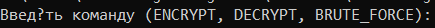

# Module1Project
Даний проект — це програма яка працює з шифром Цезаря. 
Шифр Цезаря — це шифр підставлення: у ньому кожен символ у відкритому тексті замінюють на символ, який перебуває на певному постійному числі позицій ліворуч або праворуч від нього в алфавіті.
Допустимо, ми встановлюємо зсув на 3. У такому випадку A заміниться на D, B стане E і так далі.
Однак даний застосунок використовує модифікований шифр Цезаря, оскільки він шифрує як великі та малі літери англійського алфавіту, так і деякі символи такі як:
".", ",", "!", і т.д.
Програма може запускатися як за допомогою заздалегідь встановлених аргументів, так і з використанням командного рядка безпосередньо під час роботи програми,
до того ж вона сама обирає в якому режимі їй запускатися(якщо аргументи наявні - командний рядок не запуститься, і навпаки).
Окрім стандартних функцій шифрування/дешифрування є можливість використання так званого brute_force, який автоматично підбирає ключ до зашифрованого тексту
та виводить розифрований текст в консоль.
#ІНСТРУКЦІЯ З ВИКОРИСТАННЯ ЗАСТОСУНКУ#
1. Запуск jar файлу:
   відкрити термінал, написати дану команду java -jar "шлях до jar файлу" 
   (приклад шляху: E:\JavaRush\FinalProject1\Module1Project\out\artifacts\Module1Project_jar\Module1Project.jar)
   натиснути ENTER;
2. Взаємодія з командним рядком(обрання операції):
   після виконання першого кроку повинен з'явитися такий рядок:
   
    
  
   тут потрібно обрати команду котру потрібно використати та ввести її, після чого натиснути ENTER
  
   (-ENCRYPT — зашифрувати файл;
   -DECRYPT — розшифрувати файл;
   -BRUTE_FORCE — використати brute force);
   
3. Взаємодія з командним рядком(обрання шляху до файлу над яким треба провести операцію)

   
   
   в цей рядок потрібно написати шлях до файлу який потрібно зашифрувати/дешифрувати та натиснути ENTER
   
   (приклад шляху: E:\JavaRush\FinalProject1\Module1Project\src\test.txt);
   
4. Якщо було обрано команду ENCRYPT або DECRYPT з'явиться такий рядок
   
   
   
   в якому потрібно вказати значення ключа(значення зсуву) та натиснути ENTER. (Зашифрований/дешифрований файл має з'явитися в тій же папці, 
   що й вхідний файл з позначкою [ENCRYPTED] або [DECRYPTED]).

Також можна запустити jar файл передавши всі агрументи наступним чином:
java -jar "шлях до jar файлу" command filePath key

(де: -command — операція яку треба виконати;
-filePath — шлях до вхідного файлу;
-key — значення ключа (зсуву)).
 
 Після цього натинути ENTER.
 
 *******************************************************************************************************
 
 Під час виконання проєкту вдалося виконати всі основні завдання, та додаткове завдання №3 (Поціновувач зручності).
 Було модифіковано шифр Цезаря шляхом додавання до алфавіту малих літер та символів ('.', ',', '\"', ':', '-', '!', '?', ' ').
 Окрім цього реалізовано обробку деяких помилок таких як: неправильна команда, неправильний шлях до файлу.
 Прошу звернути увагу на вивід інформації в терміналі(маю припущення що проблема з відображенням полягає в локалізації та кодуванні на Windows).
 

 
